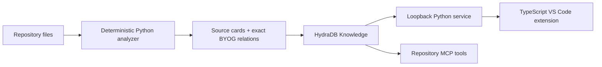

# Hydra Repository Map

Hydra Repository Map is a VS Code observability tool for agentic coding. It turns concrete repository structure into deterministic Graph IR, stores source cards and exact BYOG relations in HydraDB, and shows the same bounded HydraDB results to programmers and coding agents.

The central rule is strict: production retrieval comes from HydraDB. The analyzer prepares upload data; it is not a hidden local query fallback.

## What is included

- A Python AST analyzer with stable IDs, exact source evidence, safe discovery, projections, and graph diffs.
- A direct HydraDB API v2 adapter for ingest, status, query, relation inspection, replacement, and deletion.
- Conservative sync and revision handling with explicit failed, unavailable, and indeterminate states.
- A loopback FastAPI service for the VS Code extension.
- A repository-specific MCP server for query, focus, trace, relationship explanation, comparison, lenses, and pinned context.
- A TypeScript VS Code extension with Repository, Explore, Trace, Observe, Compare, and Preserve modes.
- An interactive 2D graph with depth controls, filters, drag, pan, zoom, evidence inspection, source navigation, a textual path view, and responsive keyboard-accessible UI.
- A confirmed `Index Workspace with HydraDB` flow that previews the configured root and exact upload scope before it writes.
- A three-condition evaluation harness with an isolated TF-IDF baseline, HydraDB graph-context ablation, checked gold facts, raw artifacts, and fail-closed claim guards.



There is no local graph database in the retrieval path.

## Requirements

- Python 3.11 or newer.
- Node.js 20 or newer.
- VS Code 1.96 or newer.
- A HydraDB API key and database for live indexing and retrieval.

## Install

From PowerShell in the repository root:

```powershell
python -m venv .venv
.\.venv\Scripts\Activate.ps1
python -m pip install -e ".[dev]"

Push-Location .\extension
npm install
npm run build
Pop-Location
```

The service reads process environment variables. [.env.example](.env.example) is a reference; it is not loaded automatically.

```powershell
$env:HYDRA_DB_API_KEY = "your-key"
$env:HYDRA_DB_DATABASE = "your-database"
$env:HYDRA_DB_COLLECTION = "current"
$env:HYDRA_DB_EVOLUTION_COLLECTION = "evolution"
$env:HYDRA_REPOSITORY_ID = "your-repository"
$env:HYDRA_REPOSITORY_ROOT = (Get-Location).Path
```

Credentials remain in the Python process. They are not sent to the extension webview.

## Preview and index

Previewing is local analysis only and does not contact HydraDB:

```powershell
hydra-graph index --revision "demo-before-change" --preview
```

After reviewing the exact files and source cards, run the upload:

```powershell
hydra-graph index --revision "demo-before-change"
```

The VS Code command `Repository Map: Index Workspace with HydraDB` performs the same preview and adds a modal confirmation before upload. The service always analyzes `HYDRA_REPOSITORY_ROOT`; callers cannot supply another filesystem root.

## Run the service and extension

Start the loopback service:

```powershell
hydra-graph serve
```

It listens on `http://127.0.0.1:8765`. The extension setting `hydra.serviceUrl` can change the port, but accepts local URLs only.

In a second terminal, open an Extension Development Host:

```powershell
code --extensionDevelopmentPath="$PWD\extension"
```

Open the Repository Map activity item or run `Repository Map: Open Repository Map`. A running service with unavailable or unverified HydraDB shows an empty degraded result. If the service itself cannot be reached, the extension can show a clearly labeled interaction preview. Preview records are never returned by the Python service or MCP tools.

## MCP setup

The running loopback service exposes Streamable HTTP MCP at `http://127.0.0.1:8765/mcp`. Use this endpoint for Observe because the MCP tools, event bus, and stored views must share one Python process.

For Codex, add this to the user-level `~/.codex/config.toml` or a trusted project's `.codex/config.toml`:

```toml
[mcp_servers.hydra-repository]
url = "http://127.0.0.1:8765/mcp"
```

Then run `codex mcp list`. Codex supports both Streamable HTTP and stdio servers; see the [official Codex MCP documentation](https://developers.openai.com/codex/mcp/).

For Claude Code:

```powershell
claude mcp add --scope project --transport http hydra-repository http://127.0.0.1:8765/mcp
claude mcp list
```

See the [official Claude Code MCP documentation](https://code.claude.com/docs/en/mcp) for scope and configuration-file options.

`python -m hydra_graph mcp --transport stdio` remains available for standalone tool use. A standalone process cannot feed the service's Observe timeline because it does not share the service event bus or view store.

## Verify

Run the complete local verification suite:

```powershell
.\scripts\check.ps1
```

The script runs Python lint and tests, TypeScript checks and tests, the production extension build, and the npm security audit. Offline HydraDB fixtures are used only at adapter and response boundaries in automated tests. Several anti-gaming tests mutate transport responses, reject mixed revisions, reject fabricated evidence, and prove that missing credentials produce an empty result without a local fallback.

The checked evaluation fixtures can rehearse the A/B/C artifact flow without making a live claim:

```powershell
python -m evaluation --offline --output .\artifacts\offline --run-id offline-rehearsal
```

A credentialed run uses `--live` instead. It requires the evaluation fixture repository and its concrete gold revision to have been indexed in HydraDB. See [demo/five-minute-runbook.md](demo/five-minute-runbook.md) and run `python demo/preflight.py --results <live-raw.jsonl>` before interpreting a comparison.

## Important limits

- The deterministic repository analyzer currently supports Python source. TypeScript is used for the extension UI, not presented as parsed repository coverage.
- The checked-out workspace has no HydraDB credentials, so the live capability spike must be run by a credentialed developer. The service remains honest and empty when credentials are absent.
- Stable source replacement in the `current` collection is not transactional. A partial write or deletion marks the collection indeterminate; the last verified revision is a marker, not a claim that the prior state is still fully visible.
- Exact relation inspection, Memory behavior, and cross-collection revision traversal remain provisional until a credentialed integration run proves their live semantics.
- Indexing remains an explicit, reviewable action. Observe watches workspace changes only to mark source-backed entities already visible in the current bounded view; it does not silently re-index files.
- Offline evaluation artifacts are rehearsals, not HydraDB performance evidence. Comparative claims require a complete credentialed A/B/C run against the exact gold repository revision.

Product and architecture decisions live in [.agents/](.agents/README.md).
