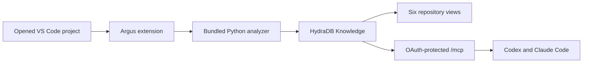

# Argus

Argus is a desktop VS Code extension for understanding a codebase, inspecting the HydraDB context returned to coding agents, and reviewing structural change over time.

The Marketplace build is plug-and-play: install the extension, open a local project, and follow the setup prompts. It bundles and manages its Python service. Users do not install Python, Node.js, packages, or a separate MCP server.

The central truth rule remains strict: production retrieval comes from HydraDB. Local analysis creates deterministic source cards and exact relations for indexing; it is never a hidden retrieval fallback.

## Use it

1. Install the platform-specific Argus VSIX or Marketplace package.
2. Open a local folder in VS Code.
3. Run **Argus: Set Up Argus** if the walkthrough does not open automatically.
4. Create or select a HydraDB account profile.
5. Enter the API key and this project's database name in masked fields.
6. Let the extension test read access, preview the index, and ask before uploading.
7. Open the Argus activity item.
8. Optionally run **Argus: Configure Agents** for Codex or Claude Code.

API keys, project database names, installation keys, and OAuth grant records live in VS Code SecretStorage. They are not placed in settings, project files, environment variables, command arguments, MCP configuration, webview messages, or logs.

## What is included

- Six views: Repository, Explore, Trace, Observe, Compare, and Preserve.
- A deterministic Python analyzer with stable IDs and line-addressable evidence.
- Confirmed HydraDB indexing with automatic Git or content-digest revisions.
- A bundled, hash-verified loopback service managed by the extension.
- One OAuth-protected Streamable HTTP MCP endpoint shared by VS Code, Codex, and Claude Code.
- Before/after graph changes and one shared System Lens.
- An isolated A/B/C evaluation harness that cannot turn offline fixtures into live claims.



## Project scope and identity

The active editor's workspace folder is the current project. A single open folder is selected automatically; an ambiguous multi-root workspace uses a native folder picker. The canonical opened folder is always the analysis boundary, even when its Git root is higher in the filesystem.

New Git projects use a credential-free fingerprint of the normalized `origin` remote. HTTPS and SSH clones of the same remote receive the same identity. Opened subprojects also receive a stable Git-relative suffix. Non-Git projects receive a random local identity stored in `.hydra-graph/identity.json`.

Existing identities are preserved. If Git is added later, Argus previews the candidate identity. It migrates automatically only when no indexed source can be orphaned; otherwise it keeps the old identity and explains why.

## Managed service and MCP

The first VS Code window starts the bundled service on loopback. Other windows authenticate, attach, and register their own project. A stale window session is discarded after a network or authentication failure so another window can take ownership. An occupied default port causes a stable alternate loopback port to be selected.

**Argus: Configure Agents** detects installed Codex and Claude Code clients, shows the exact supported CLI commands, and runs only the selected registrations after confirmation. Agent configuration contains only the current loopback `/mcp` URL. First access uses OAuth 2.1 dynamic registration, PKCE S256, short-lived access tokens, rotating refresh tokens, revocation, and a native project/scope consent dialog.

## Security boundary

The extension retrieves the account key and project database from SecretStorage for each HydraDB operation and sends them to Python through framed private stdin/stdout IPC. There is no process-lifetime credential cache. Credentials necessarily exist briefly in JavaScript and Python memory during an authenticated request; the guarantee is no unsafe persistence or long-lived cache, not impossible physical zeroization.

All managed REST routes require a short-lived token bound to one canonical root and repository ID. MCP uses its own OAuth access tokens. The service remains loopback-only and enforces host checks, size limits, rate limits, query budgets, root containment, version checks, and explicit write confirmation.

## Supported release targets

- Windows x64 and ARM64
- macOS x64 and ARM64
- Linux x64 and ARM64

The first release supports local VS Code desktop. Web extensions, Codespaces, Remote SSH, WSL-hosted extension processes, Alpine, and ARMHF are intentionally unsupported.

## Develop and verify

Contributors still use Python and Node locally. See the [development guide](docs/development.md) for setup and the [packaging guide](docs/distribution.md) for release builds.

```powershell
.\scripts\check.ps1
```

This runs Python lint/tests, TypeScript checks/tests, the extension build, and the npm audit. A credentialed HydraDB staging run is still required before publishing a release; offline fixtures are contract evidence, not live service proof.

Start with the [complete human documentation](docs/README.md), or go directly to [Getting started](docs/getting-started.md), [Views](docs/views.md), [Security](docs/trust-and-safety.md), and [Troubleshooting](docs/troubleshooting.md).
