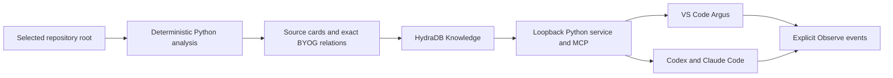

# Hydra Argus documentation

Hydra Argus is a VS Code observability application for understanding repository structure, seeing the HydraDB context returned to coding agents, and reviewing structural change over time.

The product has one strict truth boundary: repository retrieval comes from HydraDB. Local analysis prepares deterministic source cards and relations for indexing, but there is **no local retrieval fallback** when HydraDB is unavailable.

## Start here

If you want to run the application:

1. Follow [Getting started](getting-started.md).
2. Learn [what each view shows](views.md).
3. Work through the practical [Argus workflows](workflows.md).
4. Keep [Troubleshooting](troubleshooting.md) nearby for service, indexing, MCP, and revision errors.

If you first want the product mental model, read [Core concepts](concepts.md) and [Graph IR and source evidence](graph-and-evidence.md).

## What the application does

The application provides:

- Repository, Explore, Trace, Observe, Compare, and Preserve views;
- package, file, and symbol graph depths;
- deterministic stable IDs and line-addressable evidence;
- visibly separate exact and inferred relations;
- explicit, confirmed repository indexing;
- repository-specific MCP tools for coding agents;
- an observable event timeline without hidden-reasoning claims;
- before/after graph changes and one shared System Lens;
- a guarded A/B/C evaluation harness.

## End-to-end lifecycle

1. **Install:** add the platform-specific extension; its signed Python service is already bundled.
2. **Configure:** select an account profile and enter masked API-key and project-database secrets in VS Code.
3. **Preview:** analyze the selected opened project locally and review the complete source-card upload scope.
4. **Index:** confirm the write, wait for HydraDB graph creation, and establish one verified automatic revision.
5. **Explore:** ask questions and navigate bounded HydraDB-backed paths to exact source evidence.
6. **Observe:** follow explicit OAuth MCP queries, returned context, selections, evidence opens, and visible file edits.
7. **Change:** capture before and after checkpoints around an indexed edit and publish the deterministic delta to HydraDB evolution Knowledge.
8. **Preserve:** save one important grounded path as a shared System Lens and review deterministic drift later.
9. **Evaluate:** compare a source-derived baseline with HydraDB graph-disabled and graph-enabled retrieval without allowing fixtures or self-reported metrics to become live claims.

## Guides by task

### Use the application

- [Getting started](getting-started.md) — install, configure, preview, index, open the views, and optionally connect agents.
- [Argus views](views.md) — what every mode, control, status, badge, and inspector field means.
- [Workflows](workflows.md) — indexing, orientation, questions, editor focus, comparisons, lenses, and agent following.
- [Observe](observe.md) — event types, item states, pause, replay, cursor safety, and edit overlays.
- [Compare and Preserve](compare-and-preserve.md) — checkpoints, deterministic deltas, System Lenses, drift, and acceptance.
- [Accessibility](accessibility.md) — keyboard use, textual alternatives, focus, state labels, reduced motion, and responsive layouts.

### Understand the model

- [Core concepts](concepts.md) — the mental model, concrete entities, revisions, and six product modes.
- [Graph IR and source evidence](graph-and-evidence.md) — nodes, edges, stable IDs, exact versus inferred facts, evidence, cards, and projections.
- [Architecture](architecture.md) — component boundaries and the ingestion, query, Observe, and evolution data flows.
- [Glossary](glossary.md) — concise definitions for product and graph terms.

### Operate it safely

- [Configuration](configuration.md) — SecretStorage profiles, project bindings, identities, settings, and the isolated developer runtime.
- [Managed runtime](managed-runtime.md) — process ownership, multi-window attachment, ports, integrity, restart, and shutdown.
- [Packaging and distribution](distribution.md) — platform VSIX targets, native service builds, signing, provenance, and release acceptance.
- [Loopback service API](service-api.md) — supported HTTP routes, request shapes, statuses, limits, and examples.
- [Indexing and sync](indexing-and-sync.md) — preview, upload, status, replacement, deletion, indeterminate state, and recovery.
- [MCP and agents](mcp-and-agents.md) — mounted Streamable HTTP setup, available tools, Observe correlation, and standalone MCP limits.
- [Trust and safety](trust-and-safety.md) — credentials, root containment, evidence, revisions, fail-closed behavior, and unproved live semantics.
- [Troubleshooting](troubleshooting.md) — common setup, service, indexing, extension, MCP, Observe, Compare, and Preserve failures.
- [Known limits](limitations.md) — parser scope, live proof gaps, non-transactional sync, Observe scope, and honest evaluation claims.

### Evaluate and contribute

- [Evaluation and demo evidence](evaluation.md) — A/B/C conditions, metrics, artifacts, live run requirements, agent outcomes, and preflight.
- [Development guide](development.md) — setup, tests, UI preview, code boundaries, schemas, adversarial testing, and contribution rules.
- [Project layout](project-layout.md) — where runtime code, tests, schemas, fixtures, internal notes, and generated state live.
- [Five-minute live demo](../demo/five-minute-runbook.md) — the timed demonstration sequence and its evidence requirements.

## Principles to remember

- HydraDB is the production knowledge and retrieval substrate.
- Graph nodes represent concrete repository entities, not generated concept labels.
- Every exact relation must retain deterministic provenance and source evidence.
- A view is bounded retrieval, not an exhaustive whole-repository graph.
- Layout, distance, and clustering are presentation state, not architectural truth.
- Observe shows explicit events, not model thoughts or hidden traversal.
- Write workflows are previewed and confirmed.
- Missing credentials, mixed revisions, malformed evidence, and partial writes remain visible failures.

## Current scope

The implementation is complete and locally verified, but this checkout does not contain live HydraDB credentials or completed Codex/Claude evaluation artifacts. The analyzer currently supports Python repositories. Offline fixtures test contracts and rehearse the demo; they are not live performance evidence.

For internal product history, research notes, and decision records, see [`.agents/`](../.agents/README.md). For the concise repository overview, see the [top-level README](../README.md).
